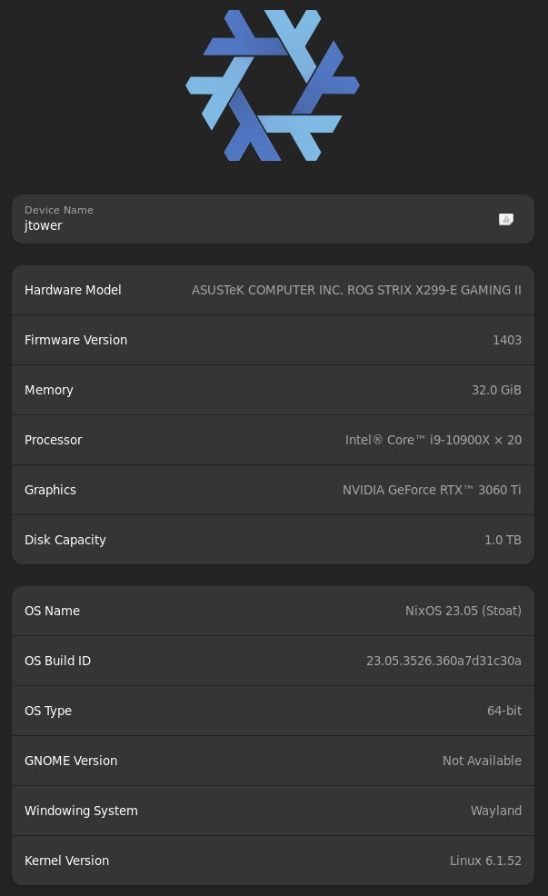

# nixos - see jtower-gen-hyprland for current setup...  
## Hyprland: consistent 240fps 1 white dot protonGE8-16.  
### ((feature reqeust of obs to capture workspaces, I use 3 workspace, gaming (fullscreen), social (discord,firefox) and dev (vscode, kitty/shell, firefox), need gaming and dev workspace capture and probs no social workspace capture.))    
.  
.  
.  
## nixos audio:
see: https://github.com/mikeroyal/PipeWire-Guide#wayland-development  
==> (1-soundboard cus y not) https://soundux.rocks/  (2-noise cancel across all programs) https://github.com/noisetorch/NoiseTorch  (3-pipewire controls) https://github.com/wwmm/easyeffects  
(for now max gain lower lower output vol should effectively noise cancel - allout) (sound ^ some exp divide by fixed val factor vs superimposed back noise program), since noisetorch is expecting pulseaudio and im going alsa it wont suffice will just increase gain in easyeffects reduce output,,, => easyeffects has noise reduction effect lul   
.  
.  
.  
## nixos security:  
I have polkit nd ssh enabled  
.  
.  
.  
## === OLD SETUP WITH GNOME ===     

- Nix os on an intel x86_64 chipset with nvidia graphics is not great for games but had ow2 running at 144 fps on protonGE-8-2 with interesting setup bugs throughout entire process => no return to pop-os for now using jtowergen12 .nix for gamez n code.     
- Hosts file config to my new nixos installs found at::: https://github.com/StevenBlack/hosts
- ``` Bash
  sudo nano /etc/nixos/configuration.nix
  ```
- ``` Bash
  nixos-rebuild switch
  ```
  ((Doesnt always require reboot unless kernel or app version))
- ```
  mv /etc/nixos/nixos/.* /etc/nixos/
  mv /etc/nixos/nixos/* /etc/nixos/
  ```
  ((should catch hidden no dotglob mod hehe))
- 1) ``` sudo su - ```
- 2) ``` code /etc/nixos --no-sandbox --user-data-dir /home/j ```
  
=== General clean up of nixos  
  
nix-env --list-generations --profile /nix/var/nix/profiles/system  
gen 12 is gamming safe  
nix-env --profile /nix/var/nix/profiles/system --switch-generation 12  
nix-env --profile /nix/var/nix/profiles/system --delete-generations 1 2 3 4 5 6 7 8 9 10 11 13 14 15   
  
===  
  
Retry with "force composition pipeline" not "force full composition pipeline" graphics config to avoid blackscreen, but for now am using full...  
See the xorg file for Xserver specific settings ((MISSING THE YB222 6-bit colour profile and such tho :c, forgot to snag it from pop os)), xorg config applies if not using wayland but might cross-over need to fig this part out. Also, protonGE-8-2 to get mouse and no blackscreen sweet spot still applies to X as well as wayland. Having full force pipeline gives buttery smooth experience with next to no graphical errors so far in gnome, but not in plasma5/kde so remember when returning back to gnome run ``` dconf reset /org/gnome/desktop/interface/cursor-theme ``` if cursor is a white box bug.       
  
===  
  
If you want to make the change permanent, you can add the shopt command to your shell's   configuration file. For example, if you are using the Bash shell, you can add it to your   
~/.bashrc file:  
  
``` bash
echo "shopt -s dotglob" >> ~/.bashrc
```
```  bash
nix run nixpkgs#betterdiscordctl install --extra-experimental-features nix-command --extra-experimental-features flakes
```  
